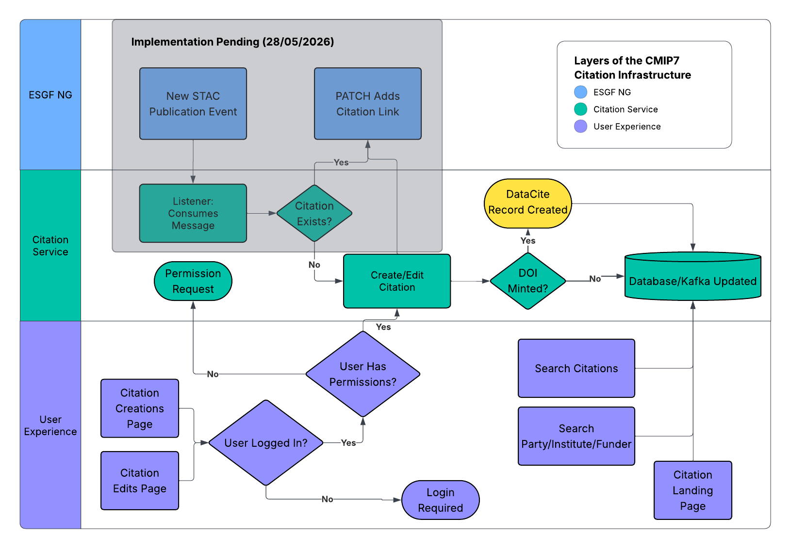

=====================
Citation Flow Diagram
=====================

The diagram above provides a visual aid to understanding the workflow of the citation service from a top-level perspective, including the integration with the ESGF publication workflow via a Listener service, the publication of datacite records to mint DOIs based on Citation Landing pages, the searchability of Citation and other record types, and the ability for reviewers to log in and create/edit records as needed.

Altering Citation Information
-----------------------------

Upon creating/editing a citation record, the following information is extracted to auto-fill relevant information for each record. This information is primarily extracted from the ESGVOC package which provides an interface to Essential Model Documentation (EMD):

- Project References
- Abstract Information
- Rights & License Information
- Affiliated Institutions
- Party Affiliations (further institutions)

These properties can therefore be refreshed simply by removing the current value and updating the record - which will then be refilled with the currently extractable values for the above.

Rendered Citation Information
-----------------------------

The following information types are determined only on rendering the citation landing page for any given citation. This allows for changes to the configuration details that affect multiple records, without having to individually adjust each record. These include:

- Data Access URL/DRS URL
- Citable Information (``Cite As``)
- Abstract Reference Links
- Licence Links
- Code Snippet for Data Access
